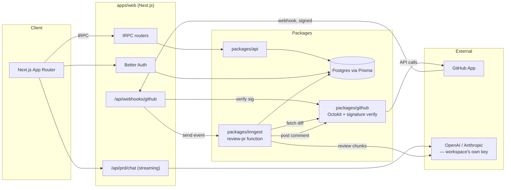

# Architecture

## System overview

## Data model

Two halves, deliberately kept separate in `packages/db/prisma/schema.prisma`:

1. **Auth tables** (`User`, `Session`, `Account`, `Verification`) — shaped to Better Auth's Prisma adapter contract exactly. Don't rename these fields without checking Better Auth's schema docs first.
2. **Product tables** — everything ShipFlow does:
   - `Workspace` / `WorkspaceMember` / `Invite` — multi-tenancy and RBAC
   - `Prd` / `PrdMessage` — the discovery chat and its structured output
   - `Task` — kanban, optionally linked back to the `Prd` it came from
   - `GithubInstallation` / `GithubRepo` / `PullRequest` — the GitHub side
   - `ReviewRun` / `ReviewComment` — one row per AI review pass (a PR gets a new `ReviewRun` on every push, not a new `PullRequest`)
   - `ApiKey` — encrypted BYOK provider keys
   - `Subscription` — plan tier and AI-review usage counter

## Key design decisions

**Prisma 6, not 7.** Prisma 7 (released Nov 2025) is ESM-only, drops the Rust query engine in favor of driver adapters, and — as of this build — has a documented Next.js 16 + Turbopack SSR resolution bug that the community workaround is literally "stay on the `prisma-client-js` generator." Prisma 6 is stable, thoroughly documented, and doesn't force an ESM migration across the whole monorepo. This can be revisited once the ecosystem settles.

**Postgres via Docker Compose, not SQLite.** The spec asked for Postgres and the schema uses real enums, which SQLite's Prisma connector doesn't support. `docker compose up -d` gets you a local Postgres in one command, so this doesn't cost you anything in setup friction.

**BYOK as the core mechanism, not a Pro-tier perk.** Every AI call — PRD generation, PR review — runs on the calling workspace's own OpenAI/Anthropic key, decrypted server-side just before use (`packages/db/src/encryption.ts`, AES-256-GCM). There's no platform-wide key anywhere in this codebase. This was an explicit ask, and it also happens to be the only sane cost model for a self-hosted tool: ShipFlow never pays your AI bill or marks it up.

**RBAC is enforced in middleware, not in the UI.** `packages/api/src/trpc.ts`'s `requirePermission()` middleware is the actual boundary; `packages/api/src/permissions.ts` is the one file that maps roles to actions. The UI hiding a button is a convenience for people who can't do a thing — it is not the mechanism that stops them. The one rule called out explicitly in the original spec — a Developer can't approve their own PR — is `pr:approve` being granted to `ADMIN` and `REVIEWER` only, never `DEVELOPER`.

**Diff chunking has a hard ceiling, not just soft batching.** `packages/github/src/diff.ts` rejects (with a clear PR comment, not a silent failure) any PR whose total changed-line count exceeds `MAX_TOTAL_DIFF_LINES` (6,000 by default) before it ever reaches the model. Below that, files are greedily packed into ~60k-character chunks so a large-but-reasonable PR still gets reviewed in parts rather than truncated silently.

**Webhook signature verification happens on raw bytes, before JSON.parse.** HMAC is computed over the exact bytes GitHub sent; re-serializing a parsed object can reorder keys and silently break verification even for a legitimate payload. See the comment in `packages/github/src/webhook.ts`.

**The AI review loop runs as discrete Inngest steps, not one long function.** Each diff chunk is its own `step.run(...)` call, so a single provider rate-limit (429) on chunk 3 of 5 retries just that step — chunks 1, 2, 4, and 5 don't re-run and don't re-bill.

**`proxy.ts`, not `middleware.ts`.** Next.js 16 renamed the file (nextjs.org/blog/next-16) and moved it to the Node.js runtime by default — not cosmetic, it's the framework's response to CVE-2025-29927, an Edge-Runtime middleware auth-bypass under load. The fix this project already had going in: `proxy.ts` only does an optimistic cookie-presence check to redirect obviously-logged-out visitors; the actual authoritative session/membership check lives in `app/w/[slug]/layout.tsx`. That split was true before the rename and remains true after it — `proxy.ts` is a routing convenience, not the security boundary.

**No fabricated social proof.** The landing page intentionally has no fake customer testimonials or invented trusted-by logos — see the inline comment in `components/marketing/philosophy-quote.tsx`. Swap in a real quote once you have a real customer.

## Known simplifications (next things to tighten, roughly in priority order)

- GitHub OAuth-based sign-in's callback URL after an invite link doesn't carry the invite token through (email/password sign-up does). Small fix, noted in `app/(auth)/signup/page.tsx`.
- Task reordering renumbers the whole destination column on every drag rather than using fractional indices — fine at real kanban-board scale, would need revisiting well before hundreds of tasks per column.
- A workspace with both an OpenAI and an Anthropic key configured always uses whichever was added first for AI review; there's no per-workspace "default provider" selector yet.
- Razorpay billing is schema-and-UI-complete but checkout is stubbed pending real merchant keys (see `packages/api/src/routers/billing.ts`).

